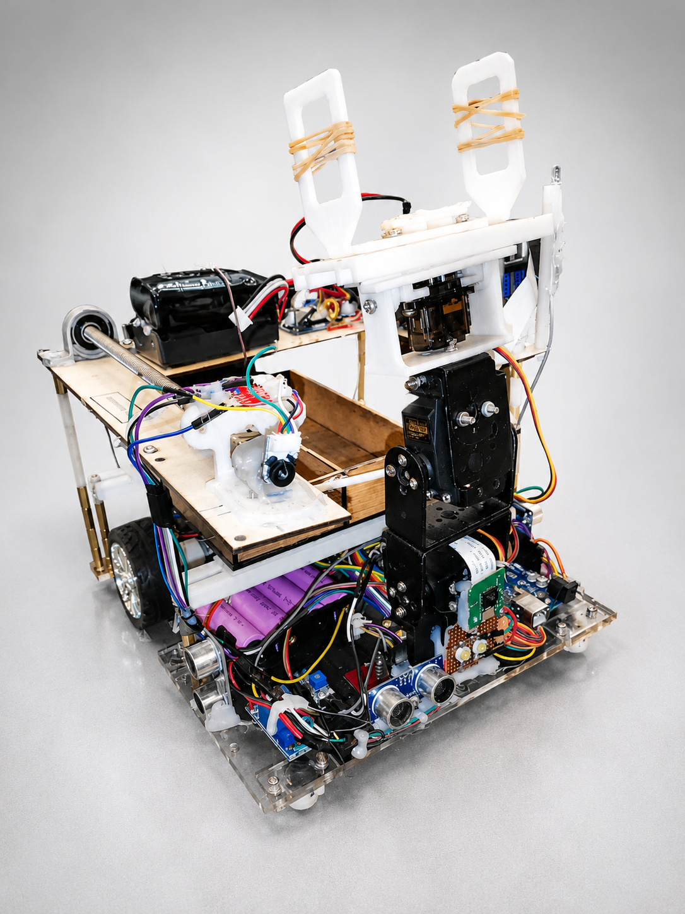

# SLRC 2026 – Autonomous Vision-Based Robotic System - Team BUMBLEBEE

## Overview

Autonomous mobile robotic system developed for the Sri Lanka Robotics Challenge (SLRC 2026). The robot utilizes computer vision, machine learning, and embedded control systems and many more technologies to perform autonomous navigation and task execution.

## Features

* Autonomous navigation and task completion
* Real-time object and shape detection
* Object detection, distance estimation using vision sensors
* Custom-trained YOLOv8 object detection model
* Raspberry Pi based perception and decision-making

## Technologies

* Raspberry Pi 4
* Raspberry Pi Camera Module V2
* YOLOv8
* PyTorch
* OpenCV
* Roboflow
* Python
* Arduino IDE
* SolidWorks

## My Contributions

* Team Leader
* Developed a custom YOLOv8 object detection model using a self-collected dataset
* Implemented computer vision pipelines for object and shape detection
* Integrated perception outputs into autonomous robot decision-making
* Participated in system integration and testing

## Project Status

Completed

Results - Finalists (Team BUMBLEBEE)
